# IT-Learning-Log
This repository logs my daily work, hands-on labs, and configuration files as I self-learn IT support, networking, data analytics, and system administration.

-- 

## Day 1   June 14, 2025

Today's Lesson:
   - What a CPU is:
        It is the brain of the computer, processing instructions and performing calculations needed to run programs.

   - What RAM is:
        The computer's short-term memory that temporarily stores programs and data currently being used.
       
   - What an IP address is:
        A unique address assigned to a device on a network so it can send and receive data.
       
   - What DNS does
        Converts websites names like google.com and youtube.com into IP addresses that computer understands.
       

### Commands Practise Today

   'hostname' --->shows the computer name
   
   'whoami' --->shows the current user thats logged in 
   
   'ipconfig' ---> shows the network configuration information
   
   'ping' ---> test the connectivity between the computer and another device
   
   'nslookup' ---> asks DNS for the IP address of a website
   
   'tracert' ---> it shows every stop(hop) the data takes to reach a website

#### My system

  - CPU: Intel i5-1335U
    
  - RAM: 8 GB DDR4

  - IPv4: 10.0.0.XXX

#### Screenshots

#### Hostname and Whoami
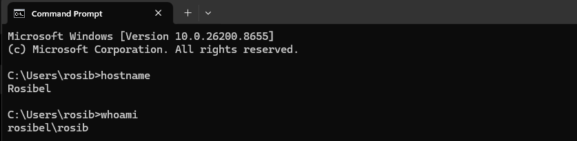

#### IP Configuration
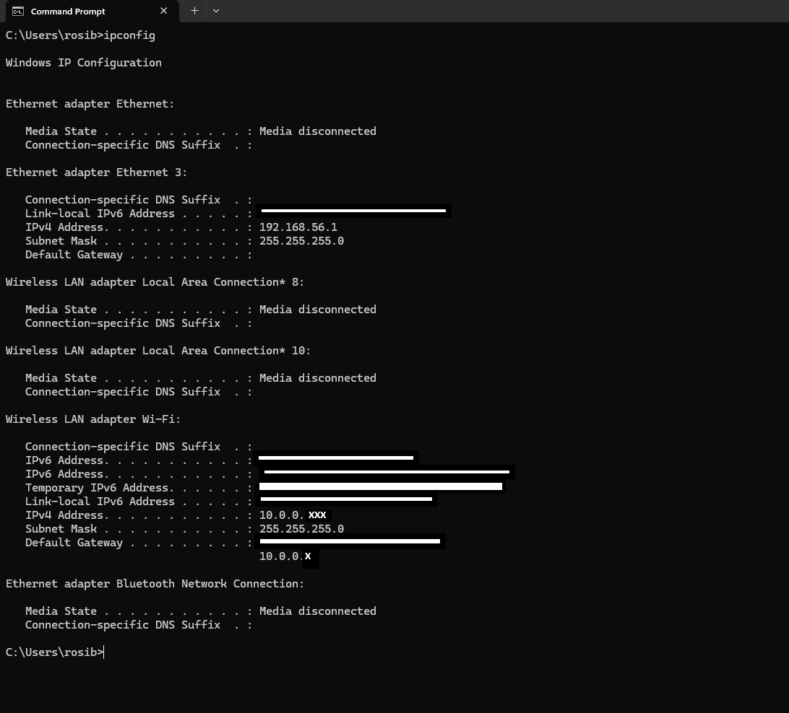

#### DNS Lookup
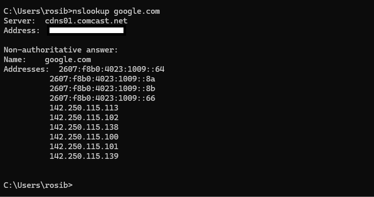

#### CPU Performance
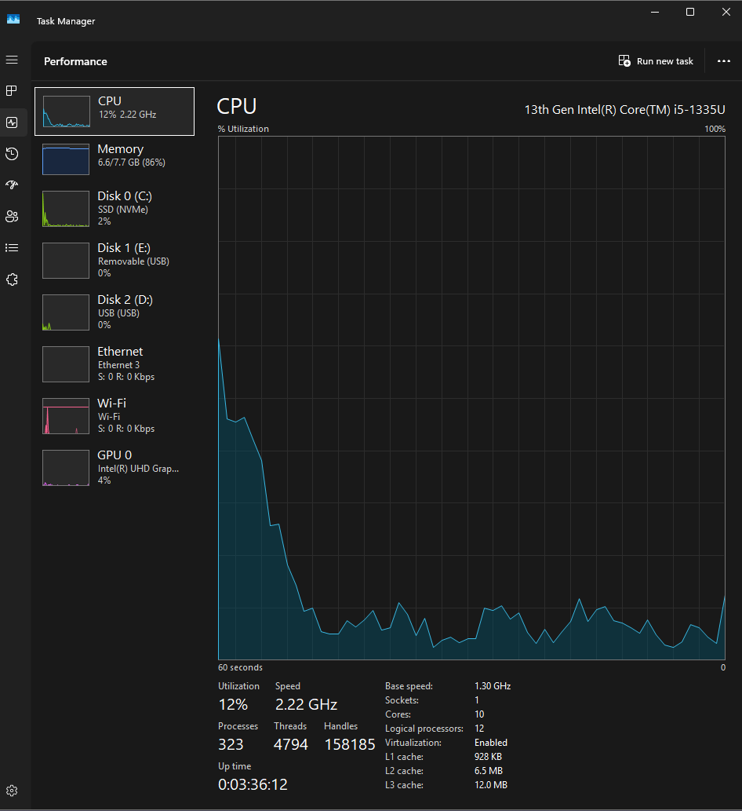

#### Disk Performance
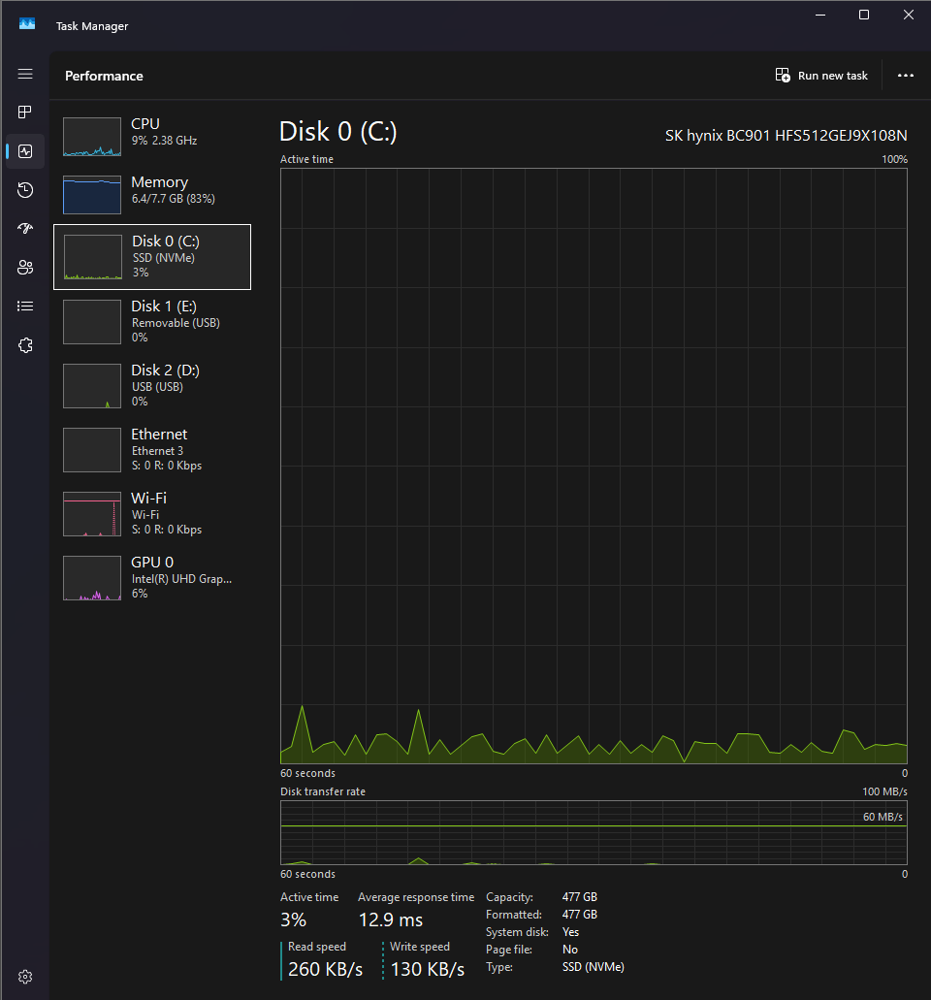

#### Memory Performance
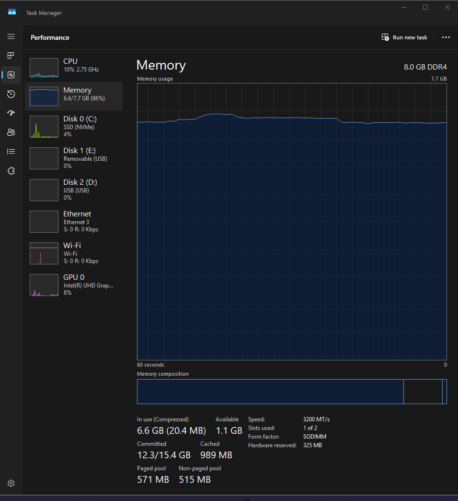

#### Wi-Fi Performance
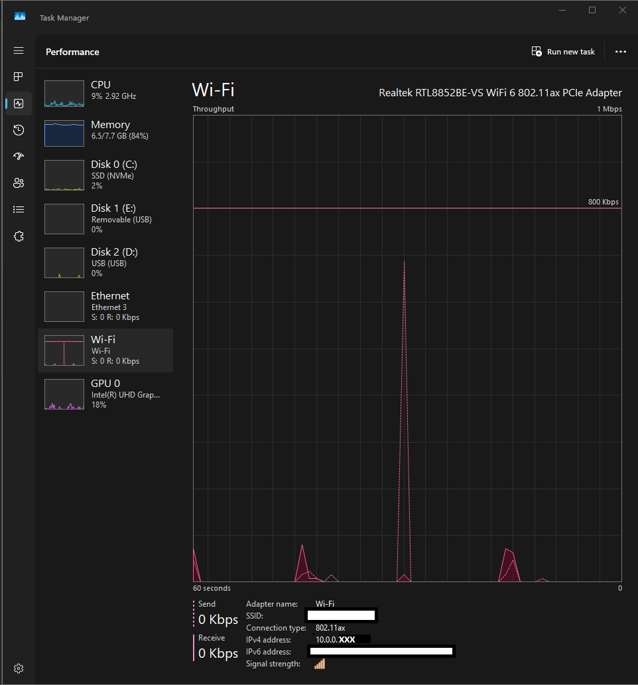

#### Ping Test
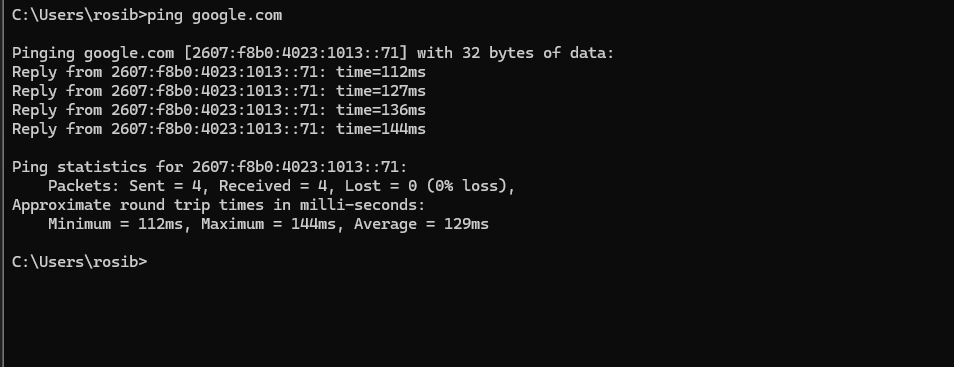

#### Running Processes (CPU)
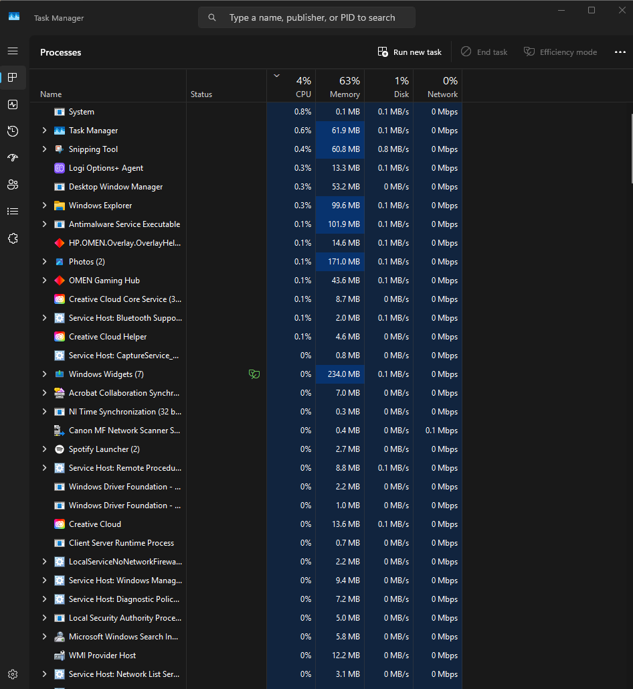

#### Running Processes (Memory)
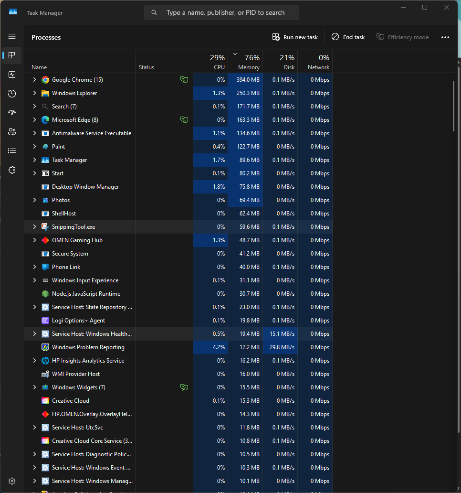

#### Traceroute
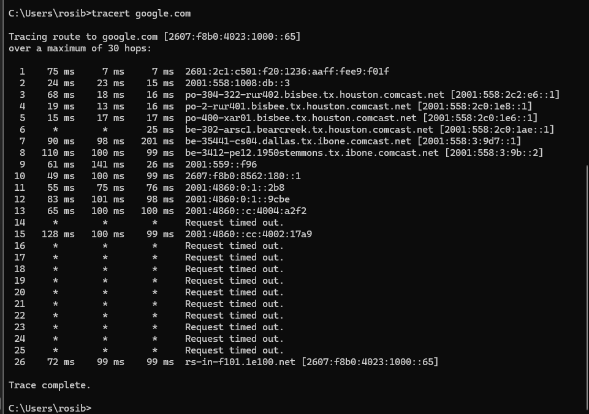

---

   # Day 2 June 17, 2026

   ## File System Basics

   ### What I learn:

   - A file stores information ex: image.jpg, music.mp3 ,.... etc.
     
   - A folder holds files and subfolders just like a everyday drawer where the drawer itself is a folder and the clothes inside are diffrent files.

   - A path tells the system where something is located like a GPS tells us where we are located or a place we want to go is located.

   - The C: drive is the main storage of a computer where window is install.

   ### Commands Practise Today

   'cd' ---> shows current folders in the currect directory
   'dir' ---> list files and folders in the currect directory
   'tree' ---> Shows the folder structure
   'mkdir' ---> creates a new folder
   'cd ..' follow with cd ---> moves back one level directory

### Screenshots 

#### Commands

#### CD Command

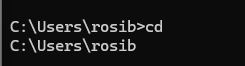

#### DIR Command

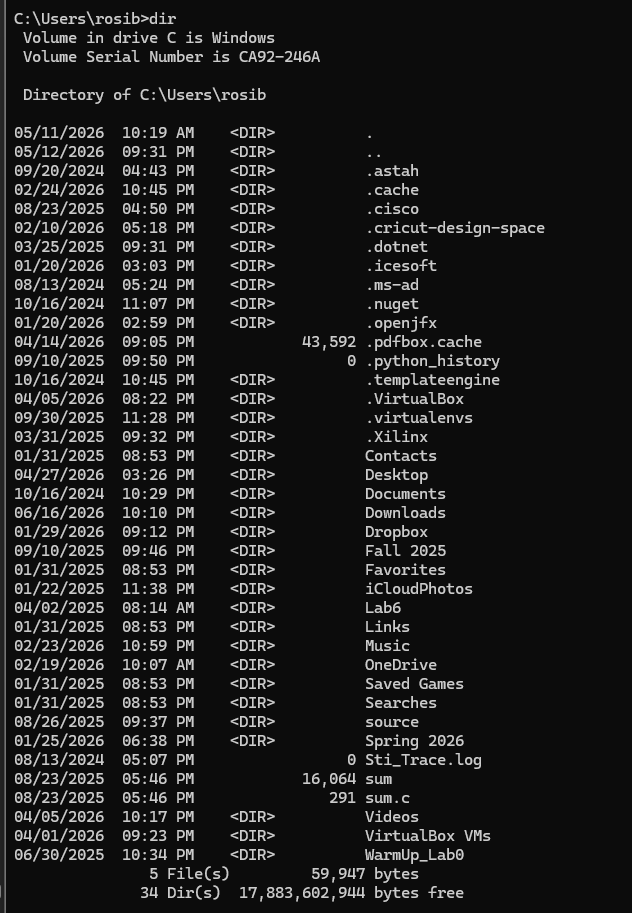

#### TREE Command

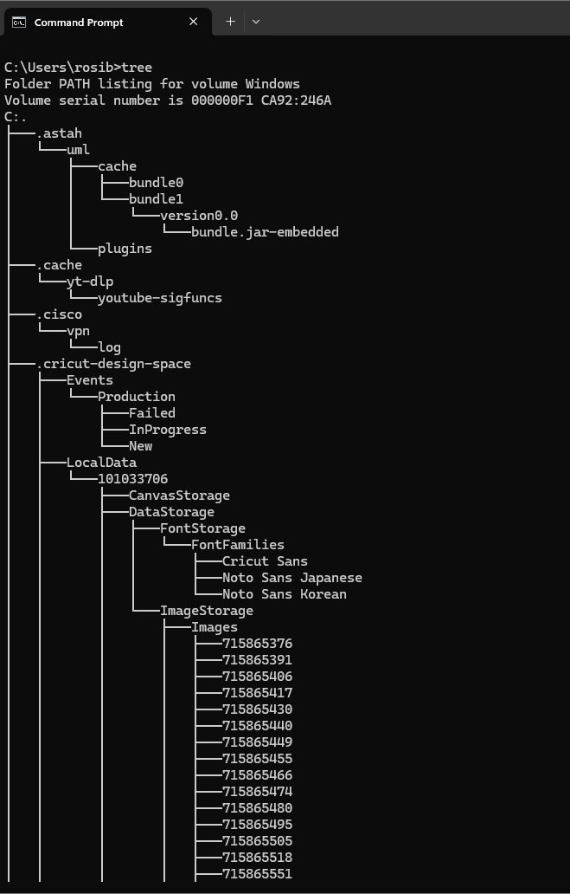

#### MKDIR Command

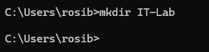

#### Creating Subfolders

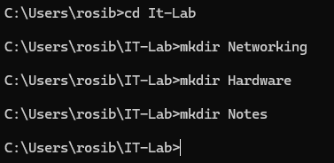

#### Folder Structure

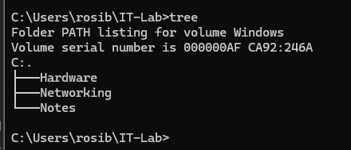

#### Returning to Parent Folder/ Moved back one level Directory

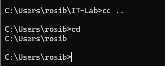

